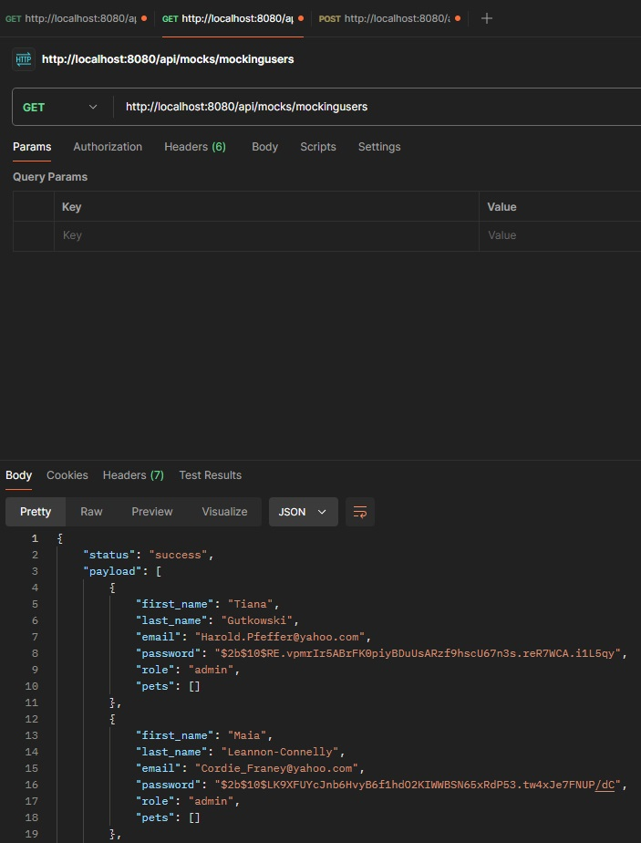

# -Coderhouse- Backend 3
## Proyecto para la creación de datos simulados de usuarios y mascotas

Este proyecto está diseñado para generar datos de prueba para las colecciones de usuarios y mascotas, utilizando la biblioteca **Faker**. Los datos generados se insertan de manera masiva en una base de datos de pruebas, lo que facilita la realización de pruebas con datos ficticios y evita el uso de información real durante el desarrollo.

## Requisitos Previos

- Tener instalados **Node.js** y **npm**.
- Contar con **MongoDB** (la URI debe estar configurada en un archivo `.env` para la conexión a la base de datos). Consulta el archivo `env.example`.

## Instalación

1. Clona el repositorio:
   ```bash
   git clone Mtofalo22/Back-End-3-coder / https://github.com/Mtofalo22/Back-End-3-coder.git

2. Instala las dependencias:
   ```bash
   npm install

3. Crea un archivo .env en la raíz del proyecto con la URI de conexión a MongoDB. Revisa el archivo env.example:
    ```bash
   MONGO_URL= <URL de mongoDB>

4. Ejecutar el proyecto:
    ```bash
   node src/app.js

## Endpoints

### Generación de Datos de Prueba

**GET**

/api/mocks/mockingpets - Genera y devuelve una lista de 50 mascotas (ficticias). No son insertadas en la base de datos.


/api/mocks/mockingusers - Genera y devuelve una lista de 50 usuarios (ficticios). No son insertadas en la base de datos.



**POST**

/api/mocks/generate-data - Genera e inserta datos ficticios en la base de datos.

Parámetros de Consulta:

users (opcional): Número de usuarios a generar (valor predeterminado: 50).
pets (opcional): Número de mascotas a generar (valor predeterminado: 50).
Ejemplo de URL: /api/mocks/generate-data?users=10&pets=10


